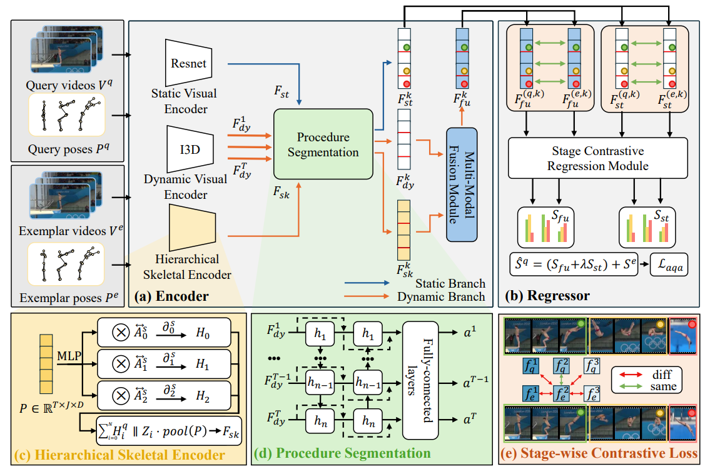
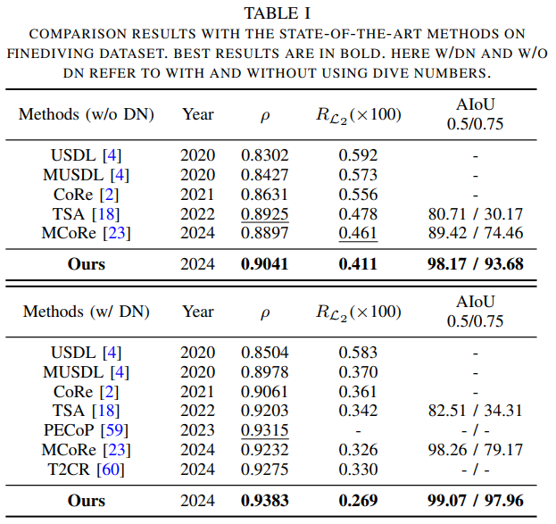

# Action Quality Assessment via Hierarchical Pose-guided Multi-stage Contrastive Regression
<p align="center">
  <a href="https://jueduilingdu.github.io/">Mengshi Qi</a><sup>1</sup>,
  <a href="https://github.com/Lumos0507">Hao Ye</a><sup>1</sup>,
  <a href="https://github.com/Lumos0507">Jiaxuan Peng</a><sup>1</sup>,
  <a href="https://scholar.google.com/citations?user=A-vcjvUAAAAJ">Huadong Ma</a><sup>1</sup>,
</p>

<p align="center">
  <sup>1</sup>Beijing University of Posts and Telecommunications &nbsp;&nbsp;
</p>

<p align="center">
  <a href="https://arxiv.org/pdf/2501.03674">
    
  </a>
</p>

Official implementation of **Action Quality Assessment via Hierarchical Pose-guided Multi-stage Contrastive Regression**.

---
<p align="center">
  
</p>

## Overview

Action Quality Assessment (AQA), which aims at automatic and fair evaluation of athletic performance, has gained increasing attention in recent years. However, athletes are often in rapid movement and the corresponding visual appearance variances are subtle, making it challenging to capture fine-grained pose differences and leading to poor estimation performance. Furthermore, most common AQA tasks, such as diving in sports, are usually divided into multiple sub-actions, each of which contains different durations. However, existing methods focus on segmenting the video into fixed frames, which disrupts the temporal continuity of sub-actions resulting in unavoidable prediction errors. To address these challenges, we propose a novel action quality assessment method through hierarchically pose-guided multi-stage contrastive regression. 

Firstly, we introduce a multi-scale dynamic visual-skeleton encoder to capture fine-grained spatio-temporal visual and skeletal features. Then, a procedure segmentation network is introduced to separate different sub-actions and obtain segmented features. Afterwards, the segmented visual and skeletal features are both fed into a multi-modal fusion module as physics structural priors, to guide the model in learning refined activity similarities and variances. Finally, a multi-stage contrastive learning regression approach is employed to learn discriminative representations and output prediction results. In addition, we introduce a newly-annotated FineDiving-Pose Dataset to improve the current low-quality human pose labels.

### **Extended Work**
Compared to the preliminary version, we leverage an additional skeletal modality to obtain hierarchical human pose features. Given the limitations in existing datasets characterized by the poor quality or absence of skeletal labels, we also present a newly-annotated FineDiving-Pose Dataset with refined pose labels, which are collected through a combination of manual annotation and automatic generation to further boost the related field.Furthermore, we propose a multimodal fusion module to integrate visual features and skeletal features and add a static branch to capture human static features. 

---

## Table of Contents
- [Release](#release)
- [Dataset](#Dataset)
- [Results](#Results)
- [Run](#Code for HP-MCoRE)
- [Acknowledgement](#acknowledgement)
- [Citation](#citation)

---

## Release
- **2025-01-08**: Released the arXiv version of the paper.
- **2025-03-16**: Uploaded training code and human-annotated pose data.

---

## Dataset

### FineDiving
We extracted and processed data from the official FineDiving dataset:
- https://github.com/xujinglin/FineDiving

### FineDiving-Pose (ours)
We expand both **human-annotated** and **automatically annotated** pose data.

- Example pose data (for format demonstration): `examples/annotations`
- You can download the human-annotated pose dataset [here](https://pan.baidu.com/s/1MjSa8lALdv4PEpUHPcGiCQ?pwd=kq89)

---

## Results
Comparison results with the state-of-the-art methods on finediving dataset. Best results are in bold. Here w/DN and w/o DN refer to with and without using dive numbers.
<p align="center">
  
</p>

---

## Code for HP-MCoRE

### Requirement
- Python 3.7.9
- Pytorch 1.10.1
- torchvision 0.11.2
> pip install git+https://github.com/hassony2/torch_videovision
### Data Preperation
The Pose data structure should be:
```text
Pose
├── 01
│   ├── pred_comp_0.npz
│   ├── pred_comp_1.npz
│   ├── pred_comp_2.npz
│   ├── ...
│   ├── pred_comp_15.npz
│   └── pred_comp_16.npz
├── FullMenSynchronised10mPlatform_Tokyo2020Replays_2
│   ├── pred_comp_0.npz
│   ├── pred_comp_1.npz
│   ├── ...
│   └── pred_comp_16.npz
...
└── FullMenSynchronised10mPlatform_Tokyo2020Replays_3
    ├── pred_comp_0.npz
    ├── pred_comp_1.npz
    ├── ...
    └── pred_comp_11.npz
```

### Pretrain Model
The Kinetics pretrained I3D downloaded from the reposity [kinetics_i3d_pytorch](https://github.com/hassony2/kinetics_i3d_pytorch/blob/master/model/model_rgb.pth)
> model_rgb.pth

### Run
```bash
bash train.sh HP rny002_gsm gru 0,1
```
## Acknowledgement
Our evaluation code is build upon [MCoRe](https://github.com/Angel-1999/MCoRe). 
## Citation
If you find this project useful in your research, please consider citing:

> ```
> @article{qi2025action,
> title={Action Quality Assessment via Hierarchical Pose-guided Multi-stage Contrastive Regression},
> author={Qi, Mengshi and Ye, Hao and Peng, Jiaxuan and Ma, Huadong},
> journal={arXiv preprint arXiv:2501.03674},
> year={2025}
> }
> 
